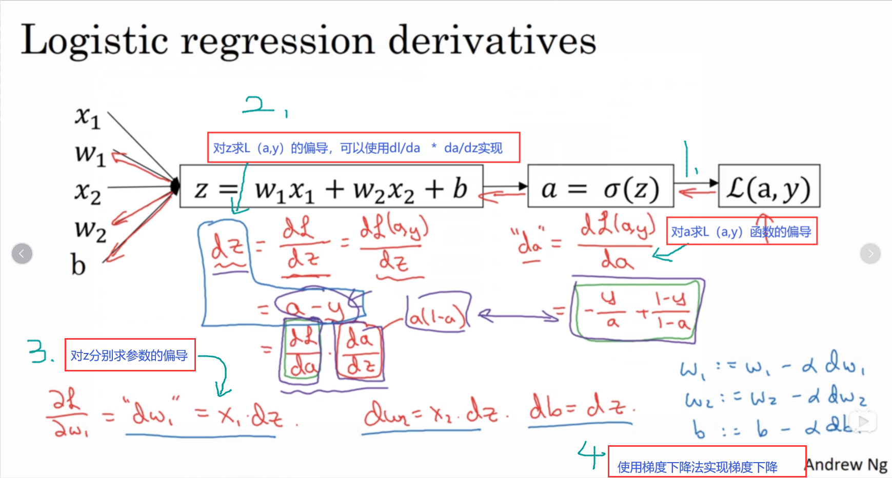
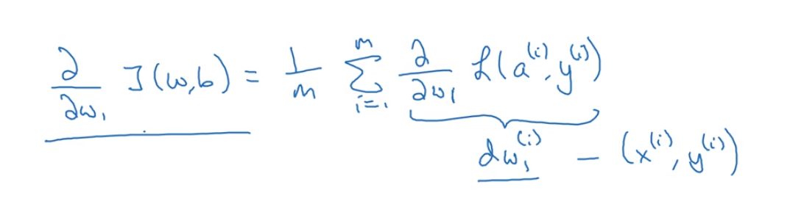
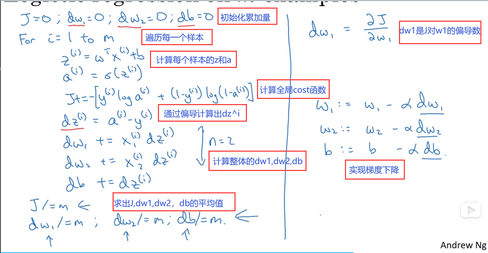
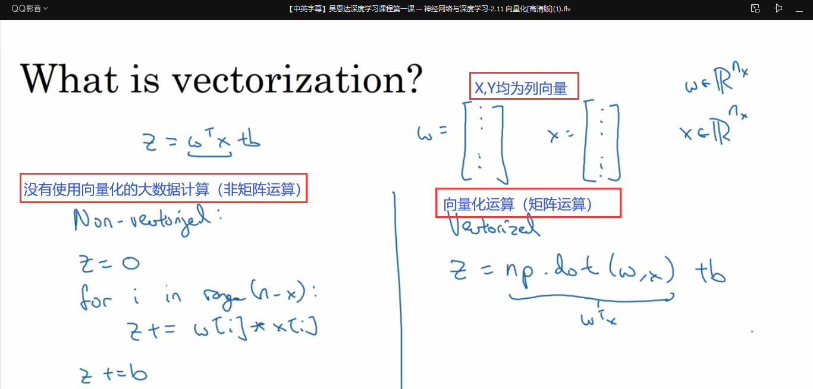
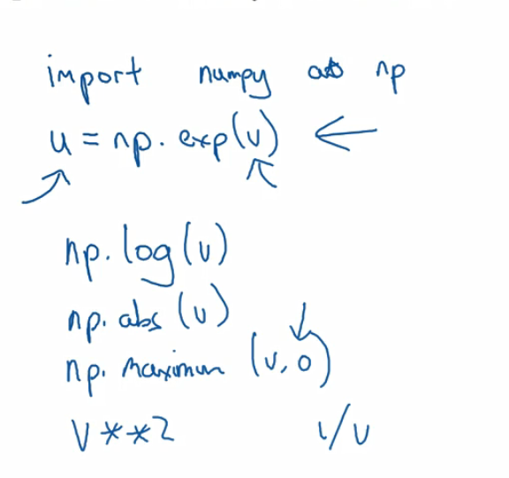

# 第3周学习报告  

`@Author 卢林军`  
`@Date 2020315`  
[logic回归新的梯度下降](#1) | [m个样本的梯度下降](#2) | [向量化(Vectorization)](#3)

```
吴恩达的深度学习入门
（学得有点少，被大物的刚体折磨呜呜呜）
```

# <a id='1'>新的梯度下降</a>
利用偏导数的方式实现logic回归中的梯度下降


# <a id='2'>m个样本的梯度下降</a>

* 全局cost函数，是一个求和实际上时1到m项 loss函数的求和，因此全局cost函数对w1的偏导，也同样是各项loss函数对w1的偏导数的平均值
* 

1. 对m个样本梯度下降
 

# <a id='3'>向量化(Vectorization) </a>

1. 以logic回归为例，我们在计算Z的时候的区别
    
    * 向量化能有效降低运算时间
2. 记录运行时间的函数
    * 包time
    * `time.time()`记录到这条指令时的时间
    * 可以在代码的上方和下方都写上`time.time()`然后将两个时间相减，获得这段代码的运行时间，单位是毫秒
3. 对向量中的每个数实现相同操作：
    * 比如，让x向量中的每个数都变为e^x(i),可以使用`np.exp(v)`
    * 还有其他的一些使用方法：
        * 
4. 如何对多个测试样本，不用for实现预测呢？

```
    X = [x1,x2,……,xn]
    Z = [z1,z2,……,zn]=w^T * X +[b,b,b,b] 
      = [w^T * x1+b, w^T * x2+b,……,w^T * xn+b]
```