# 第4周学习报告  

`@Author 卢林军`  
`@Date 2020.3.21`  
[神经网络图的意义](#1) | [神经网络的输出](#2) | [多个例子中的向量化](#3) | [激活函数](#4) | [神经网络梯度下降法](#5) | [随机初始化权重](#6)

```
吴恩达深度学习第三周学习内容
```

# <a id='1'>神经网络图的意义</a>

1. 下面是一张单层神经网络样子
    * 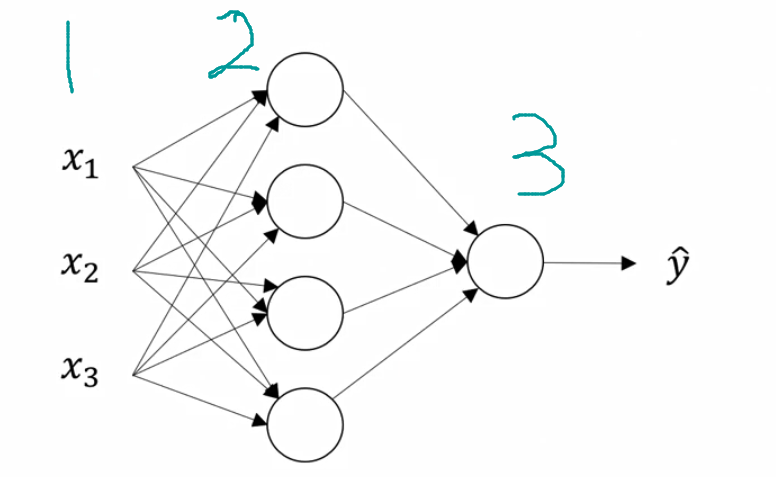
    * 1是神经网络的输入层，由样本的各个特征叠加起来
    * 2是神经网络的隐藏层
    * 3是圣经网络的输出层，输出预测值
2. 隐藏层的含义是：在训练集中，这些中间结点的中间数值我们无法看到，我们能扛到输入层和输出层的数据，中间的计算过程无法看到，因此叫做隐藏层。
3. 输入特征的另一种表示方式`a^[0] = x`这里的a也表示激活的意思，它意味着网络中不同层的值会传递给后面的层。
    * 当然下一个隐藏层也会产生激活值，我们称这个值为`a^[1]`
4. 在我们计算神经网络的层数时是不计算输入层的。如上图，隐藏层就是我们神经网络的第一层，输出层就是我们神经网络的第二层，我们把输入层称为第0层。因此我们把这个神经网络称为双层神经网络
5. 隐藏层和最后的输出层是带有参数的我们同样用`变量名^[i]`表示是第几层的哪个变量。

# <a id='2'>神经网络的输出</a>

1. 以逻辑回归为例，神经网络的计算方式如图：
    * 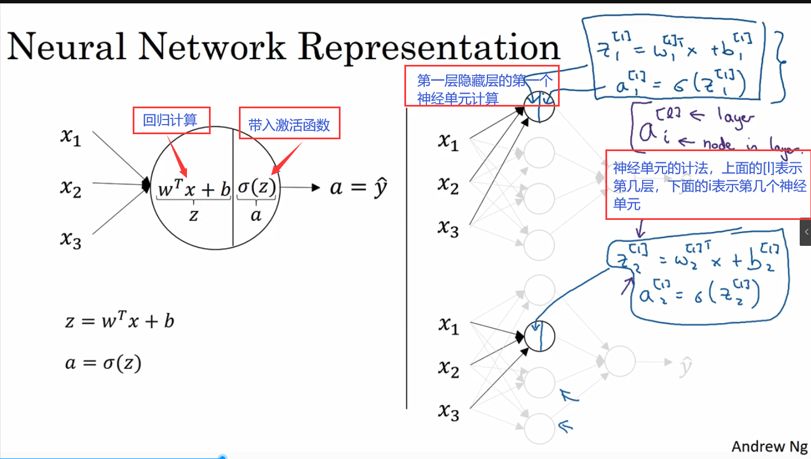
    * 计算方式和原来的逻辑回归没什么差别，主要是在隐藏层的时候要在每一个结点计算一次

2. 隐藏层——>输出层的计算：
    * 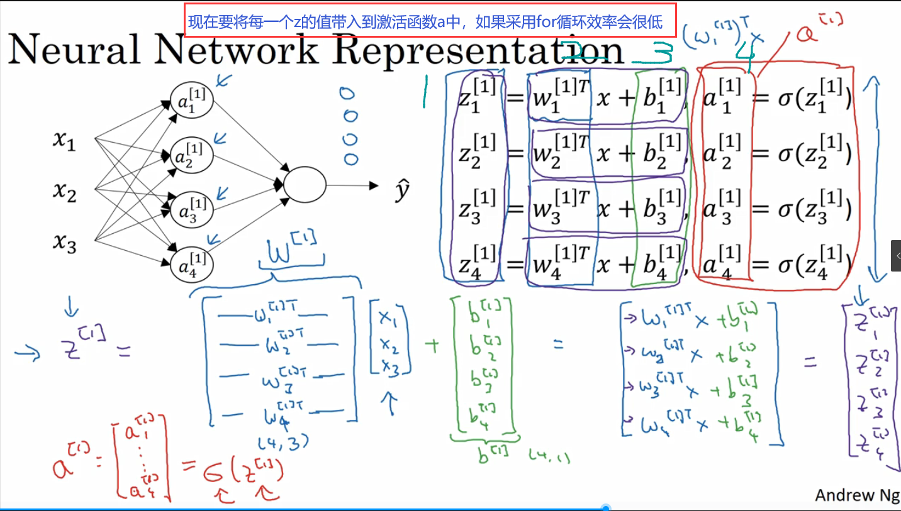
    1. 我们采用向量化z的方法，然后带入到激活函数中
    2. 所有的w原本都是一个列向量，现在将他们转置，就变成一行就是一个样本的w，我们在用矩阵相乘的方法计算出全部的w^T*x就能迅速算完
    3. 同时讲所有的b做成列向量，与w^T*x相加，这样我们就能得到由线性计算得到的向量Z
    4. 将这个向量z带入到我们的激活函数a = sigmore()函数中进行计算。

# <a id='3'>多个例子中的向量化</a>

1. 对于多个测试集，如果不采用向量化的方法，就得一个一个地遍历对测试集，这对算法的效率极低。
2. 用向量化的方法进行神经网路哦计算
    * 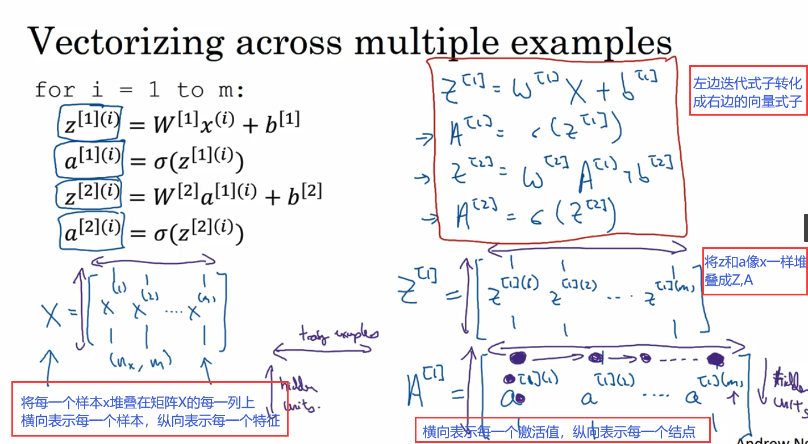
    * 我们的测试集X要乘上w^(1)（n * xn阶）因为每一个x样本都要和w^(1),使用传统做法就得遍历所有的x集合，使用向量化的方法，就能用一个式子实现一个循环，极大地提高了计算速率。

# <a id='4'>激活函数</a>

1. 要搭建一个神经网络，可以选择隐藏层里用哪一个激活函数，到目前为止，我们一直使用的是Sigmore激活函数，但有时其他函数效果要好得很多

2. 我们的激活函数可以是非线性的下面，提供几个常用的激活函数
    * sigmoid函数： $g(z) = \frac 1{1+e^{-z}}$
        * 除非用在二分类的输出层，不然不要用
    * tanh函数（值介于-1到1之间,在数学上实质是sigmoid函数平移后的版本）：$a = tanh(z) = \frac {e^z-e^{-z}}{e^z+e^{-z}}$
        * 使用tanh函数会使得输入集的平均值趋向于0，而不是像sigmoid函数一样趋向于0.5
        * tanh函数在任何场合都几乎比sigmoid函数优秀
        * 只有当我们的输出层要使用0,1时，可以选用sigmoid函数作为激活函数
        * 不同层使用的激活函数可以不同，你可以在隐藏层使用tanh函数，在输出层使用sigmoid函数。
    * 修正线性单元(ReLU)：$a = max(0,z)$
        * 只要为正，导数就是1，为负，导数就是0
        * 当z = 0时，导数是没有定义的，但是在实际编程中，为0的可能性很小，但如果真的遇到了，可以赋值成1或0
        * 如果你的输出层要输出0,1，在二分类问题中，那么sigmoid函数很适合作为输出层的激活函数，然后其他所有单元都用ReLU,如果不确定用哪个，就用ReLU
    * 泄露修正函数(Leaky ReLU)：$a = max(0.01z,z)$
        * 这里第一个参数的0.01可以自己设置
    * 函数图像：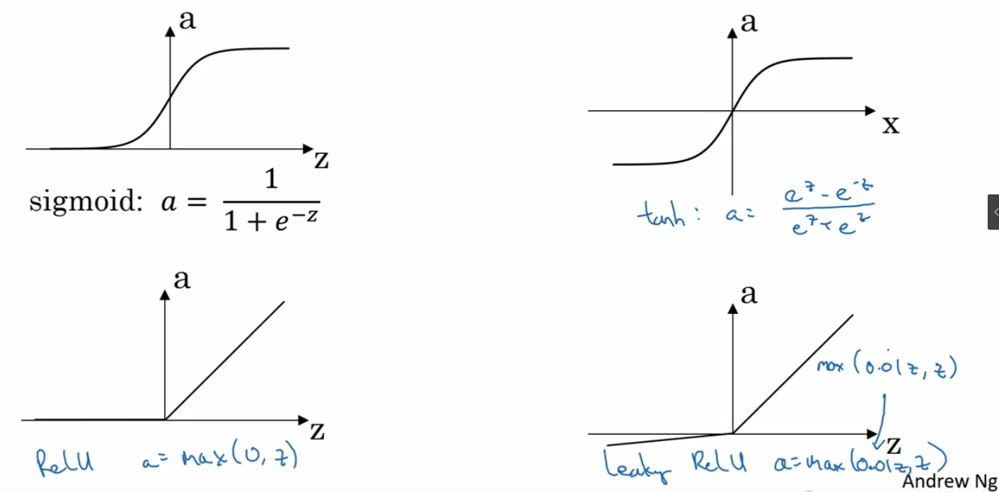
3. 为什么神经网络需要非线性激活函数？
    * 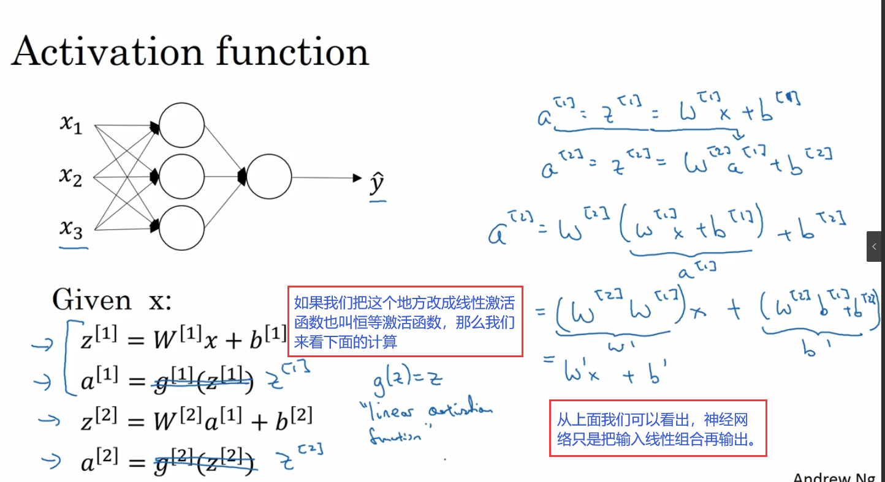
4. 激活函数的导数
    * sigmoid函数导数：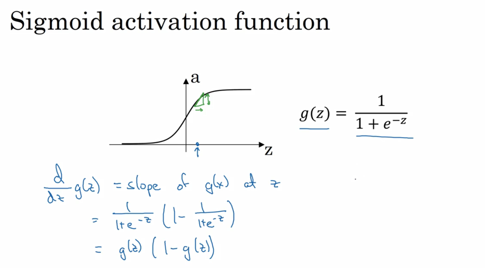
        * 也可以表示为：$g^{,}(z) = a(a-a)$ ，$a = g^{,}(z)$
    * tanh函数导数：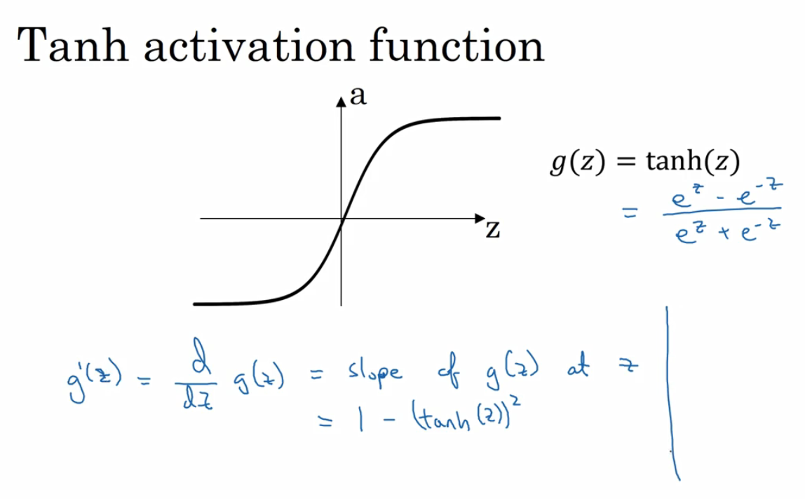
    * ReLU和泄露ReLU函数：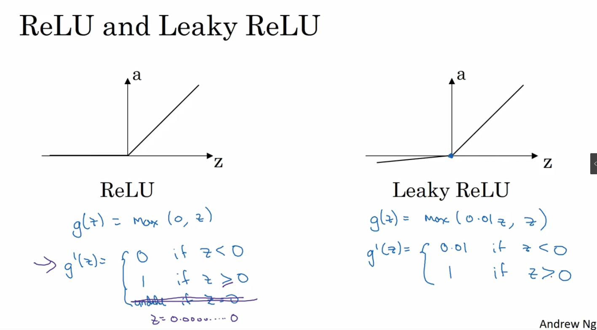

# <a id='5'>神经网络梯度下降法</a>

1. 在训练神经网络时，随机初始化参数很重要，而不是初始化全0
2. 神经网络的正向传播和反向传播：
    * 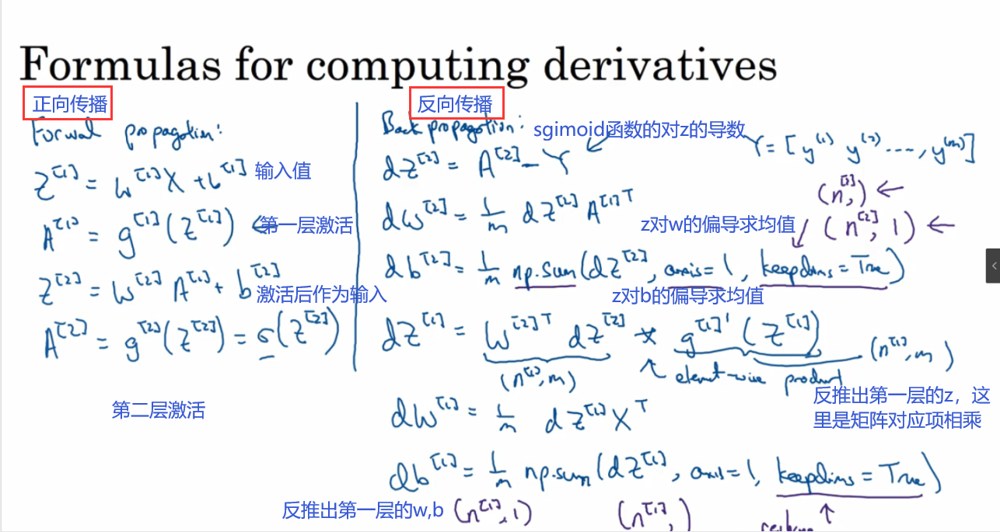

3. 神经网络的反向传播推导过程：
    * 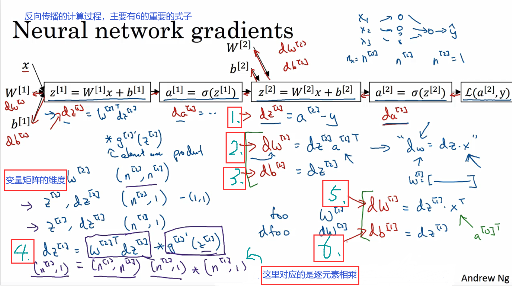

4. 神经网络反向传播向量化方法：
    * 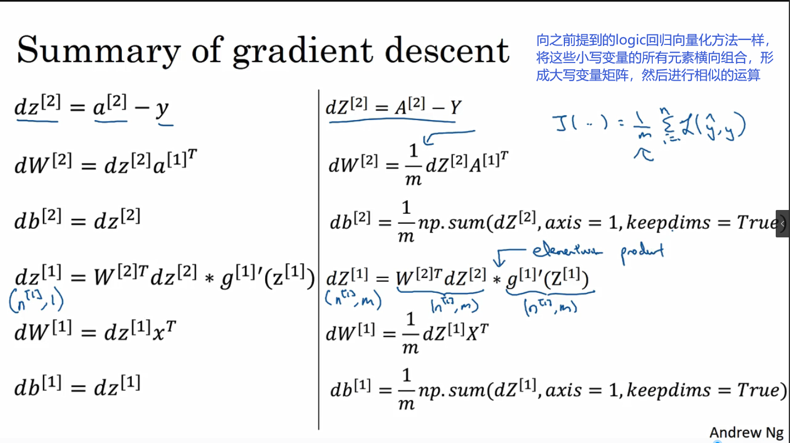

# <a id='6'>随机初始化权重</a>

1. 对于logistic回归，可以将权重初始化为0，但如果将神经网络的各参数数组全部初始化为0，再使用梯度下降算法，那会完全无效。
2. 在隐藏层的计算中，如果我们设置的w和b全为0，也许设置b为0还可行，但是如果设置w为0就会导致，当前隐藏层中的所有节点都是在进行相同的计算，使得在正向传播中$a_1^{[1]} = a_2^{[1]}$;在反向传播中$dz_1^{[1]} = dz_2^{[1]}$,z这使得两个隐藏单元对输出单元的影响一样大，那么在一次迭代之后，同样的对称性依然存在，两个隐藏单位仍然是对称的，所以通过归纳到三次迭代就可以证明，无论你训练升级网络多长时间，两个隐藏单元仍然在计算完全一样的函数。这样一点用都没有，因为你需要两个不同的隐藏单元，去计算不同的函数。
3. 解决方案：
    * 可以令$W^{[1]} = np.random.randn((n,n))*0.01$可以产生一个n*n阶的符合高斯分布的随机变量矩阵，然后乘一个很小的数，我们就会将权重初始化成很小的随机数，如果使用的不是0.01而是100或1000，就会导致学习速率缓慢
    * 对于b，因为b完全没有这个对称性问题，所谓的破坏对称性问题，因此吧b出书画成0也是可以的$b^{[1]} = np.zeros((n,1))$
    * 同样的其他参数也可以进行上述类似操作$W^{[2]} = np.random.randn((1,n))*0.01$ ,$b^{[2]} = 0$