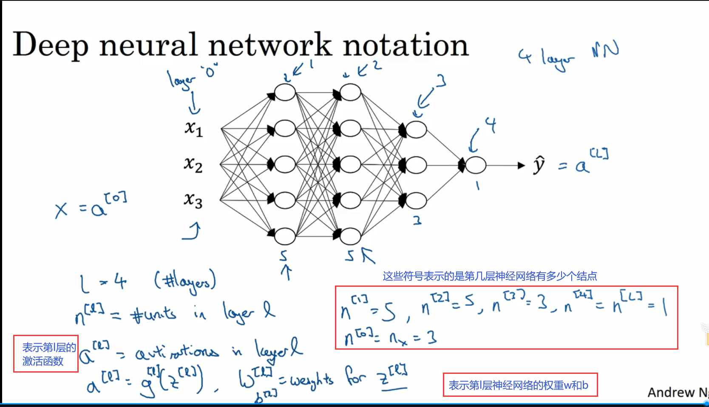
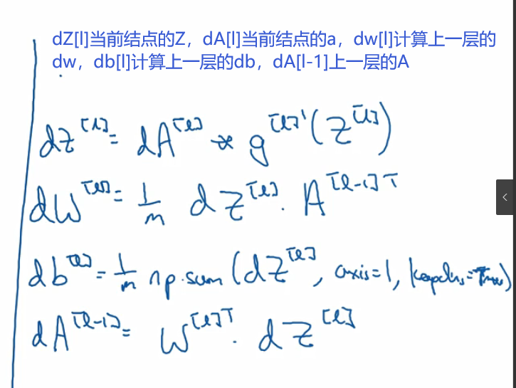
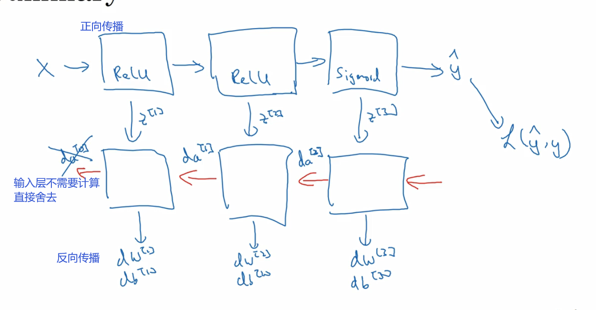
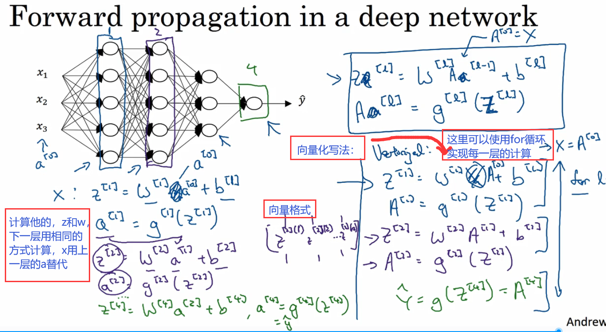
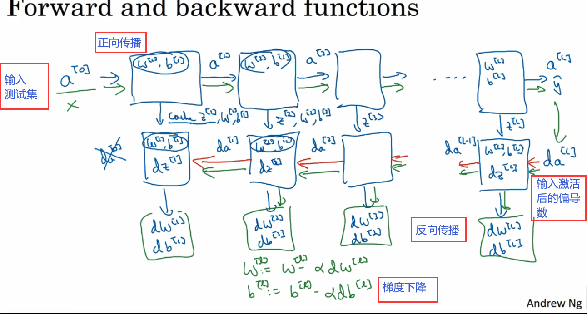

# 第5周学习报告  

`@Author 卢林军`  
`@Date 20200328`  
[深层神经网络](#1) | [为什么使用深层表示](#2) | [搭建深层神经网络块](#3)

```
吴恩达深度学习第五周内容
```

# <a id='1'>深层神经网络</a>

1. 神经网络的符号：
    * 
    * 输入用$x = a^{[0]}$表示，输出用$y = a^{[L]}$表示
2. 反向传播
    * 
    * 
    * 对反向传播的输入是我们的lost函数的导数
    * 对sigmoid函数来说他的反向传播输入就是$da^{[l]} = -\frac ya + \frac {1-y}{1-a}$
    * 向量化后的sigmoid反向传播输入为：$da^{[l]} = -\frac {y^{(1)}}{a^{(1)}} + \frac {(1-y)^{(1)}}{(1-a)^{(1)}}$······$-\frac {y^{(m)}}{a^{(m)}} + \frac {(1-y)^{(m)}}{(1-a)^{(m)}}$
    * 即每一个样本经过反向求偏导后的数值累积成向量的和
3. 正向传播
    * 
4. 核对矩阵的维数
    * 首先要确定我们要输入下一层的A是多少维度的$A^{[l]}$是($n^{[l]}$,1)的，$n^{[l]}$是当前这层的结点数目，然后我们用同样的方法观察上一层输入的$A^{[l-1]}$是几维矩阵，($n^{[l-1]}$,1)的。
    * 根据公式$Z^{[l]} = W^{[l]} * A^{[l-1]} + b^{[l]}$
    * $Z^{[l]}$是（$n^{[l]}$，1）的，$A^{[l-1]}$是($n^{[l-1]}$,1)的显然$W^{[l]}$应该为（$n^{[l]}$，$n^{[l-1]}$）的
    * 对于$b^{[l]}$应该为（$n^{[l]}$，1）的
    * $dW^{[l]}$与$W^{[l]}$维度相同
    * $db^{[l]}$与$b^{[l]}$维度相同
    * w,b,dw,db的维数基本不会发生变化
    * 但是在向量化中，Z,A往往是多个样本的叠加，因此，我们的Z,A的维度也不一定完全就是（$n^{[l]}$，1），一般是（$n^{[l]}$，m）,m为样本的个数
    * 在同一层中Z与dZ的维度是相同的，A与dA的维度也是相同的
  

# <a id='2'>为什么使用深层表示</a>

1. 深度神经网络能解决很多问题，其实并不需要很大的神经网络，但是得有深度，得有比较多的隐藏层。
2. 深度网络究竟在计算什么？
    * 如果你在建一个人脸识别或是人脸检测系统，深度神经网络所做的事就是，当你输入一张脸部的照片，然后你可以把深度神经网络的第一层当成一个特征探测器或者边缘探测器，第一层用于探索这张图片的各个边缘，然后把照片里组成边缘的像素们放在一起看，然后第二层可以把被探测到的边缘组合成面部的不同部分，然后第三层，再将这些部分放在一起，就可以识别或是探测不同的人脸了。
    * 边缘探测器其实相对来说都是针对照片中非常小块的面积，面部探测器，就会针对于大一些的区域，但主要概念是一般会从比较小的细节入手，比如边缘，然后再一步步到更大更复杂的区域，再把这些区域组成更复杂的部分。
    * 这种简单到复杂的金字塔状表示方法或者做成方法，也可以应用在图像或者人脸识别以外的其他数据上。
3. 关于神经网络为何有效的理论：
    * 来源于电路理论，它和你能够用电路元件计算哪些函数，有者分不开的联系，根据不同的基本逻辑门。
    * 在非正式的情况下，这些函数都可以用相对较小，但很深的圣经网络来计算。
    * 小的意思是，隐藏党员的数量相对比较小，但是如果你用浅一些的神经网络计算同样的函数，也就是说在我们不能用很多隐藏层时，你会需要呈指数正常的单元数量才能达到相同的计算结果。

# <a id='3'>搭建深层神经网络块</a>

1. 构建和单层神经网络都差不多，主要还是正向传播和反向传播以及梯度下降，但是他计算的w，b,dw,db变多了。
    * 

2. 参数vs超参数
    * 在计算过程中我们有$w^{[L]}$和$b^{[L]}$，同时还会有其他的一些参数，比如学习率α，因为我们需要设置α来决定，你的参数如何进化，或者还有梯度下降法循环的数量
    * 在你的算法中也许有其他你想要设置的数字，比如隐藏层数L，或是隐藏单元$n^{[L]}$,你还可以选择激活函数，在隐藏层中用ReLU还是tanh还是sigmoid。
    * 上面提到的参数都需要你来手动设置，这些数字实质上控制了最后参数W和b的值，所以我们称他们（α，$n^{[L]}$，ReLU...）为超参数,因为这些参数都是能控制W和b的。
    * 因为这些超参数某种程度上决定了最终得到的W和b，实际上深度学习有很多不同的超参数，比如momentum，mini batch size,几种不同的正则化参数等等
    * 假设你知道一个最好的α是0.01，然后你可以实际试一下，训练一下看看效果如何，然后基于尝试的结果你会发现，你觉得学习率设定再提高到0.05会比较好。如果你不确定，什么值是最好的，你大可以先试试一个学习率α，再看看损失函数J的值有没有下降，然后你可以试一试大一些的值，然后发现损失函数的值增加并发散了，然后可能试试其他数，看结果是否下降的很快或者收敛到在更高的位置，你可能尝试不同的α兵观察，损失函数J怎么变化，试试一组值，然后可能损失函数会变成不同的样子。当我们找到α的值会加快学习过程，并且收敛在更低的损失函数值上，我们就选用这个α的值
