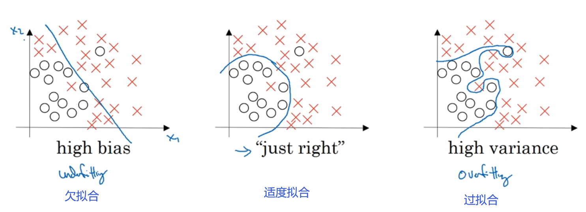
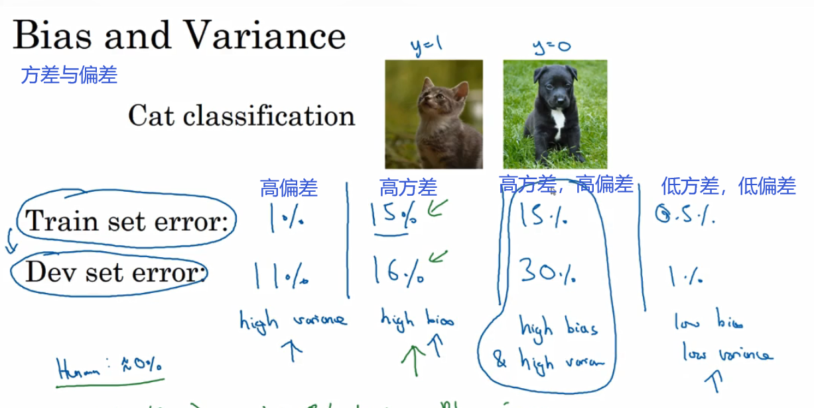
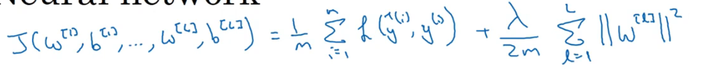
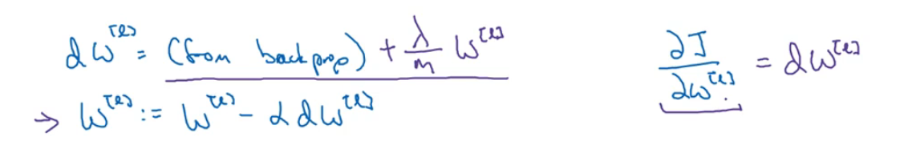
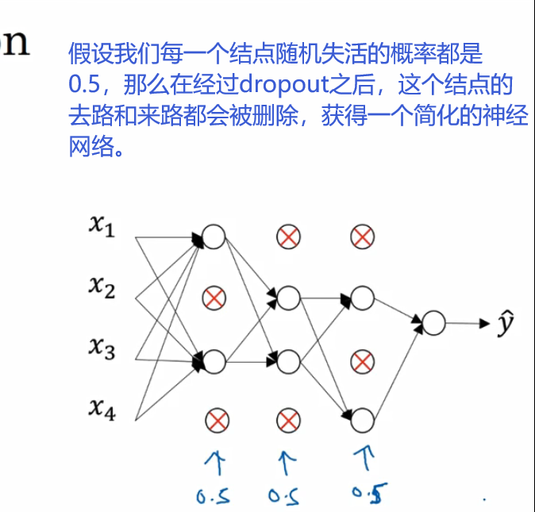
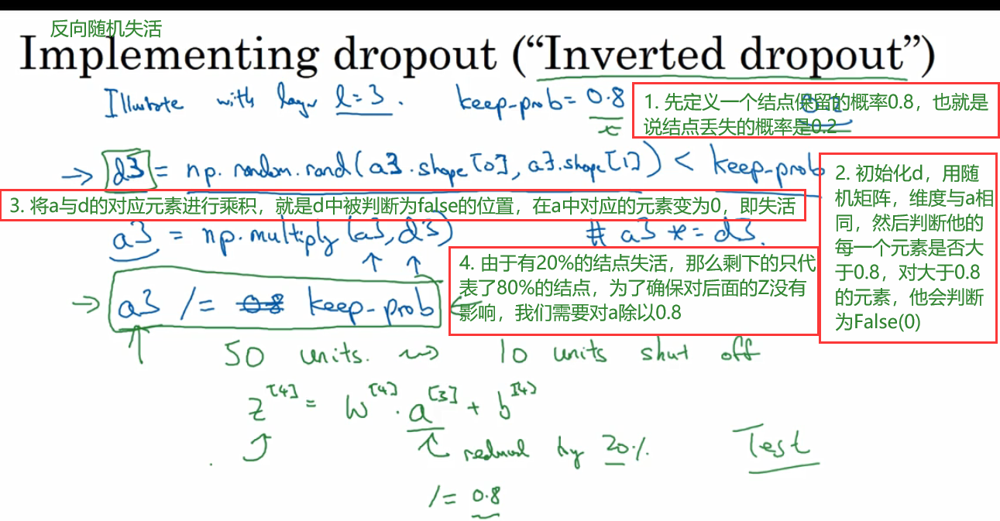
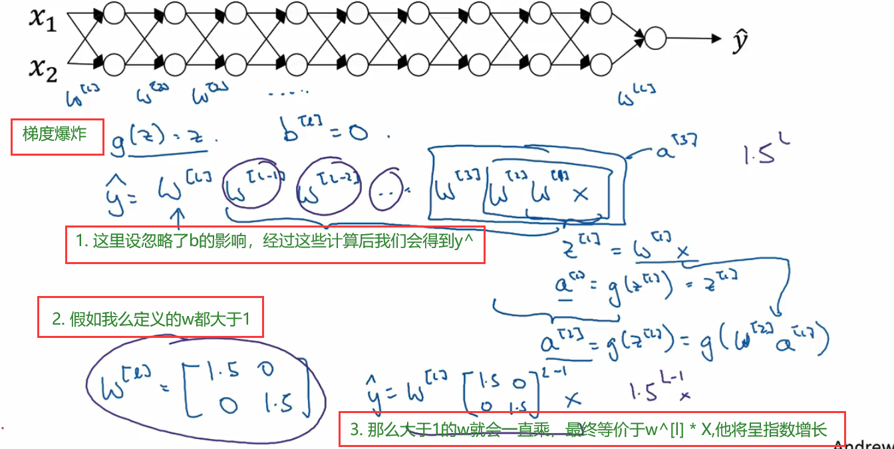
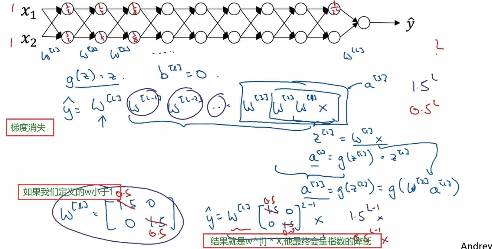

# 第6周学习报告  

`@Author 卢林军`  
`@Date 20200405`  
[偏差——方差](#1) | [训练神经网络](#2) | [正则化](#3) | [归一化](#4) | [梯度消失与梯度爆炸](#5) | [神经网络权重的初始化](#6)

```
在这里简单的写一下一周总结
```

# <a id='1'>偏差——方差</a>

1. 如果给个数据集拟合一条直线，可能得到一个逻辑回归拟合，但并不能很好地拟合该数据集，这是偏差高的情况，我们称为欠拟合
2. 如果我们拟合一个非常复杂的分类器，比如深度神经网络或含有隐藏单元的神经网络，可能就非常适用于这个数据集，但是这看起来也不是一个很好的拟合方式，分类器偏差较高，数据过度拟合
3. 复杂程度适中，数据拟合适度的分类器，这个数据拟合看起来更加合理，我们称之为“适度拟合”，是介于过拟合和欠拟合中间的一类
    * 
4. 测试集的错误率很低训练集的错误率较高，我们称之为高偏差
5. 算法并没有在训练集中得到很好训练，如果训练数据的拟合度不高，就是欠拟合，就可以说这种算法方差比较高
    * 
6. 模型训练结束后，如果偏差较高，试着评估训练集或训练数据的性能，如果偏差的确很高，甚至无法拟合训练集，那么你要做的就是选择一个新的网络，比如有更多隐藏层或者隐藏单元的网络或者花费更多时间来训练网络花费更多时间训练算法或者尝试更先进的优化算法。
7. 当偏差降低到可以接受的数值，检查一下方差有没有问题，为了评估方差我们要查看验证集的性能，如果方差很高，最好的解决办法是采用更多数据（训练数据），但是有时候，我们无法获得更多数据，我们可以尝试通过正则化来减少过拟合，当我们找到低偏差和低方差的模型后，我们就成功了。

# <a id='2'>训练神经网络</a>

1. 训练神经网络时，我们需要作出很多决策：
    * 神经网络的层数
    * 每层的隐藏单元个数
    * 学习速率是多少
    * 各层采用的激活函数是什么
    * 我们不可能一开始就准去预测出这些信息，和其他超级参数，实际上，应用型机器学习是一个高度迭代的过程，通常在项目启动时我们会先有一个初步想法，比如构建一个含有特定层数，隐藏单元数量，或数据集个数等等的神经网络，然后编码并尝试运行这些代码，通过运行和测试得到该神经网络或这些配置信息的运行结果，然后根据输出结果完善自己的想法改变策略，或为了找到更好的圣经网络不断迭代更新自己的方案

2. 创建高效的数据集
    * 我们通常会将这些数据划分成几个部分，一部分作为训练集，一部分作为简单交叉验证集，最后一部分则作为测试集
    * 通常在普通的机器学习中我们通常使用二八三七六二二的方法划分数据集，当然这是可行的，但是现在是大数据时代，我们的数据集可能高达百万条，这样的划分就显得不合理，于是产生了98-1-1的划分方式

# <a id='3'>正则化</a>

1. 如果神经网络过度拟合了数据，即存在高方差的问题，那么最先想到的方法可能就是正则化了，另一个解决高方差的方法就是准备更多数据，这也是非常可靠的办法，但你可能无法时时准备足够多的训练数据，或者获取更多数据的成本很高，但正则化通常有助于避免过度拟合或减少网络误差
2. 以逻辑回归展示正则化的一般过程
    * 对于逻辑回归来说，我们要求cost函数J的最小值于是我们有公式
    * $J(w,b) = \frac 1m \sum_{i=1}^m l(y^i,y^{(i)}) + \frac {\lambda}{2m}||w||^2_2$
    * 后面的$||w||^2_2$表示的是w平方的欧几里得范数，他等于wj（j值从1到nx）平方的和即：$||w||^2_2 = \sum_{j=1}^{n_x}w_j^2=w^Tw$
    * 这个方法叫做L2正则化，因为这里用了欧几里得法线被称为向量参数W的L2范数
    * 还有一种方式就是L1正则化，他是$\frac {\lambda}{m} \sum_{j=1}^{n_x}w_j = \frac {\lambda}{m} ||w||_1$
    * L1正则化使得模型变得稀疏，不是为了压缩模型，人们在使用上更倾向使用L2正则化
3. 在神经网络中实现L2正则化
    * 公式：
    * $||W^{[L]}||^2_F = \sum_{i=1}^{n^{l-1}}\sum_{j=1}^{n^{l}}(w_{ij}^{[l]})^2$因为这里的w是$(n^{[l-1]},n^{[l]})$阶的，该矩阵范数被称作弗罗贝尼乌斯范数
    * 
    * 这个等价于$w^{[l]} = w^{[l]}-{\alpha}$($\frac {\lambda}mw^{[l]}+dw$)=$(1-\frac {{\lambda\alpha}}m)w^{[l]}-{\alpha}dw$
    * 正因为前面这个$(1-\frac {{\lambda\alpha}}m)<1$因此L2范数正则化也被称为“权重衰减”
4. 为什么正则化可以减少过拟合？
    * 在正则化过程中，如果我们的神经网络过拟合，对于$\lambda$如果趋于无限大，我们的$w^{[l]}$趋于0，那么我们在梯度下降过程中，大部分层的单元影响就会变小，即压缩神经网络。我们过拟合的模型会随着$\lambda$的增大而逐渐趋向欠拟合，我们要找到中间的这个既不过拟合也不欠拟合的值。
    * 如果正则化参数$\lambda$过大，那么对应的$w^{[l]}$就会变小，$Z^{[L]}$也会变小
    * 在增加正则化的方法之前定义的代价函数J，我们做过修改，增加一项，目的是预防权重过大。

5. dropout正则化（随机失活）
    * 如果我们的神经网络存在过拟合，dropout会遍历网络的每一层，并设置消除神经网络结点的概率。
    * 
    * 这里是单纯的遍历结点，编码也是随机的，但是他真的有效
6. 如何实现dropout？
    * inverted dropout(反向随机失活)
    * 
    * 利用Inverted-dropout技术，在测试的时候，不使用dropout（不随机失活神经元），不保留训练过程计算中使用过的1/keep-prob因子
7. 理解dropout：
    * dropout可以随机删除网络中的神经单元，看上去不太合理，可他为什么可以通过正则化发挥这么大的作用？
    * 第一个直观认识：在每次迭代之后神经网络都会变得比以前更小，因此采用一个较小的神经网络好像和使用正则化的效果时一样的。
    * 第二个直观认识：我们从单个神经元入手，这个单元的工作就是输入并生成一些有意义的输出，通过dropout该单元的输入几乎被消除。就是说下一个单元它不能依靠任何特征，因为特征都有可能被随机清除，或者说改单元的输入也都可能被随机清除。
    * 实施dropout的结果与L2正则化语言，他会压缩权重，并完成一些预防过拟合的外层正则化，事实证明，dropout被证实地作为一种正则化的替代形式，L2对不同权重的衰减是不同的，他取决于倍增的激活函数的大小。
    * 每一层设置的keep——prob（保留概率）可以不相同，如果是1就等价于保留所有的单元，对于输入层的保留概率应该是输入为1的。

8. 其他的正则化方法
    * 想增加数据来解决过拟合问题，但是获取困难，我们可以使用同一张图片，然后对其进行水平翻转，于是我们的训练集就可以扩大一倍，这虽然不如再找一组的效果好，但是这为我们节省了寻找数据的花费，我们甚至可以随意裁剪图片
    * 我们通常吧上面的方法称为数据增强
9. 权重衰减是一种正则化技术，使得每次迭代，权重都缩小
# <a id='4'>归一化输入</a>

1. 归一化输入需要两个步骤
    * 第一步是零均值化
        * $u = \frac 1m {\sum^m_{i = 1}}x^{(i)}$
        * $x = x - u$
    * 第二步是归一化方差
        * ${\sigma}^2 = \frac 1m{\sum_{i=1}^m}(x^{(i)})^2$
        * $x /= {\sigma}^2$
2. 开发和测试集应该来自同一分布
3. 归一化输入，使成本函数更快地进行优化

# <a id='5'>梯度消失与梯度爆炸</a>

1. 当你训练神经网络时，导数的坡度有时会变得非常大或者非常小，甚至以指数方式变小，这加大了训练的难度。
2. 梯度爆炸：
    * 
3. 梯度消失：
    * 
4. 总结：如果权重w只比1略大一点或者只比大为矩阵大一点，神经网络的激活函数将爆炸式增长，如果w比1略小一点，在神经网络中，激活函数将以指数级递减。

# <a id='6'>神经网络权重的初始化</a>

1. 
2. 梯度的数值逼近
    * 双边误差计算公式：令f(x)的导数为g(x)
    * $\frac {f(x+{\epsilon}) - f(x-{\epsilon})}{2{\epsilon}}{\approx}g(x)$
    * $\epsilon$取很小的值
3. 为了执行梯度检验，首先要做的就是，把所有参数转换成一个巨大的向量数据，你要做的就是吧矩阵W转化成一个向量，把所有W矩阵转化成向量之后，做链接运算，得到一个巨大的向量θ。该向量表示为参数θ。代价函数J时所有W和b的函数，现在你得到了一个θ的代价函数J，接着你得到与W和b顺序相同的数据，比如$dW^{[1]}$、$db^{[1]}$、……、$dW^{[l]}$、$db^{[l]}$用他们来初始化大向量dθ它与θ具有相同的维度，然后用相同的的方法吧这些dw转化成一个大向量dθ
4. dθ和代价函数J的梯度或坡度有什么关系？
    * 这就是梯度检验（grad check）的过程
    * 我们首先明确θ是J的一个超级参数
    * dθappox = $\frac {J(\theta_1,\theta_2,...,\theta_i + \epsilon) - J(\theta_1,\theta_2,...,\theta_i - \epsilon)}{2\epsilon}{\approx}\frac {dJ}{d\theta_i}$
    * 我们要比较是否dθappox${\approx}\frac {dJ}{d\theta}$
    * 方式使用欧几里得距离：
    * 如果结果很小（比$10^{-7}$小），那么梯度检验成功，如果大于$10^{-5}$则可能存在bug检查是否有哪一个权重较大，如果大于$10^{-3}$那么存在bug的可能性很大，需要检查每一个θ的值
5. 在神经网络试试梯度检验的实用技巧和注意事项
    * 首先不要在训练中使用梯度检验，它只用于调试
    * 如果算法梯度检验失败，要检查所有项，检查每一项并试着找出bug
    * 在实施梯度检验时，如果使用正则化，请注意正则项。一定要包含正则项。
    * 梯度检验不能与dropout同时使用
    * 当w和b接近0时，梯度下降的实施是正确的，在随机初始化过程中，大事在运行梯度下降是w和b变得更大，可能只有在w和b接近0时，backprop的实施才是正确的，但是当W和b变大时，他会变得越来越不准确。

