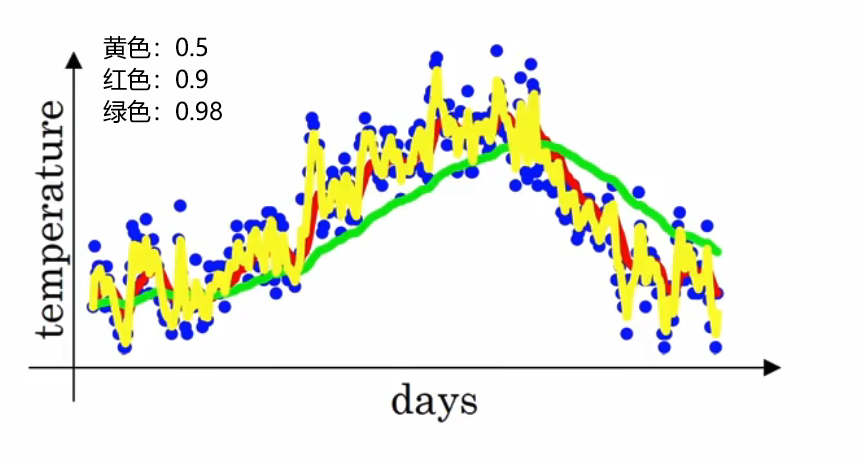
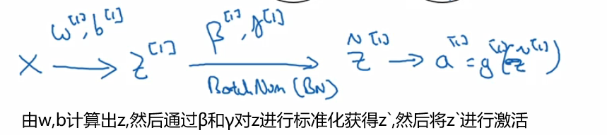
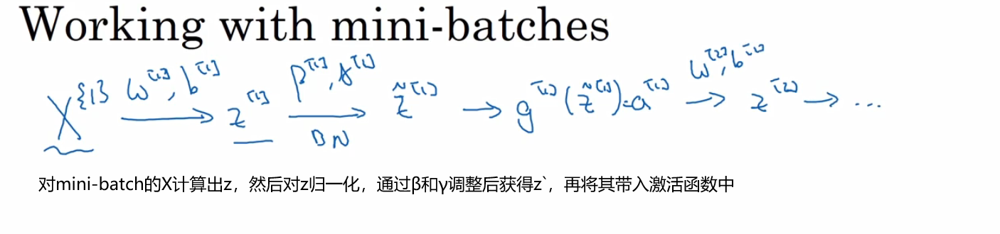

# 第7.8周学习报告  

`@Author 卢林军`  
`@Date 2020415`  
[Mini-batch梯度下降法](#1) | [动量梯度下降（momentum梯度下降法）](#2) | [RMSprop](#3) | [Adam优化算法](#4) | [学习率衰减](#5) | [调试处理](#6) | [batch归一化](#7) | [softMax回归](#8)

```
优化算法
```

# <a id='1'>Mini-batch梯度下降法</a>

1. 把训练集分割为小一点的子训练集，这些自己被取名为Mini-batch
2. 假设我们的总样本数有5000000，每个Mini-batch有1000个样本，那么我们的数据集合标签可以划分成5000个Mini-batch（1000*5000=5000000）
3. 我们把在数据集中划分出来的Mini-batch称为$X^{\lbrace 1 \rbrace},X^{\lbrace 2 \rbrace}...X^{\lbrace n \rbrace}$,由他们组成新的X
4. 我们把在标签中划分出来的Mini-batch称为$Y^{\lbrace 1 \rbrace},Y^{\lbrace 2 \rbrace}...Y^{\lbrace n \rbrace}$,由他们组成新的Y
5. 因此我们把第t个mini-batch称作：$X^{\lbrace t \rbrace},Y^{\lbrace t \rbrace}$
6. 回顾一下这些符号
    * $x^{(i)}$是第i个训练样本
    * $z^{[l]}$表示神经网络中第l层的Z值
    * $X^{\lbrace t \rbrace},Y^{\lbrace t \rbrace}$表示不同的mini-batch
7. mini-batch的维度：
    * n代表特征数，m代表每个mini_batch划分出来的样本数
    * 对于$X^{\lbrace t \rbrace}$他的维度是（n,m）
    * 对于$Y^{\lbrace t \rbrace}$他的维度是（1,m）
8. 算法思路：
    * 假设我们有5,000,000个样本，我们每个mini-batch中有1000个数据
    * 用for循环遍历5000次，每次都代表一个$X^{\lbrace t \rbrace},Y^{\lbrace t \rbrace}$
    * 然后用他们完成向前传播
    * $Z^{[l]} = W^{[l]}X^{\lbrace t \rbrace} + b$
    * $A^{[l]} = g^{[l]}(Z^{[l]})$
    * 计算cost值,这里的x,y都是当前的mini-batch,正则项可加，是Frobenius膜平方的总和
    * $J^{\lbrace t \rbrace} = \frac 1{1000}\sum_{i=1}^m l(y^i,y^{(i)}) + \frac {\lambda}{2*1000}||w^{[l]}||^2_F$
    * 然后开始方向传播，得到对应d参数
    * 开始更新我们的参数
    * $W^{[l]} = W^{[l]} - \alpha dW^{[l]}$
    * $b^{[l]} = b^{[l]} - \alpha db^{[l]}$
    * 当我们完成一次循环我们就能实现一次下降，我们把遍历完所有的数据集一次称为一轮
    * 传统的梯度下降，一轮只下降一次，而对于mini-batch一轮下降了500次，速度提高
    * 如果我们遍历完一轮下降精度还没达到我们想要的结果，可以在这个循环外面再套一层循环，直到下降到我们想要的精度
9. 理解：
    * 对于一般的梯度下降，他下降一般是平滑的，对于mini-batch他可能是有上下波动地下降，原因可能是你前面的mini-batch比较简单，计算出来的J值较小，后面的mini-batch比较复杂，计算出来的J值比较大，但总体还是在下降的。
    * 如果我们的mini-batch的大小是m那么他就是普通的梯度下降了，要遍历所有的样本才能下降一次，花费时间过长
    * 如果我们的mini-batch的大小是1，那么他叫做随机梯度下降法，因为你给的样本太瘦，可能导致每次下降的方向偏移得很大，因此这个方法是有很多噪声的。他永远不会收敛，只会在最小值附近波动。会失去所有向量化给你带来的加速
    * 因此要选择不大不小的mini-batch，他离最小值的距离肯定比随机下降小，但他也不一定在很小的范围内收敛或者波动，如果出现这个问题可以慢慢减小学习速率
    * 使用小批量(mini-batch)梯度下降训练一次迭代（在单个小批量上计算）比使用批量梯度下降训练一个epoch更快。


# <a id='2'>动量梯度下降（momentum梯度下降法）</a>

1. 指数加权平均：
    * 假设我们要计算温度的局部平均或者移动平均
    * 令当天的温度为θ，平均值为V
    * 我们要计算第二天和第一天的平均
    * $V_2 = 0.9*V_1 + 0.1*\theta_2$
    * 第三天和第二天的平均
    * $V_3 = 0.9*V_2 + 0.1*\theta_3$
    * 由此我们可以得出：
    * $V_t = \beta V_{t-1} + (1-\beta) \theta_t$
    * 如果我们的β=0.9的话那么他大概等于$\frac 1{1-\beta} \approx 10$天的平均气温
    * 如果我们的β=0.98的话那么他大概等于$\frac 1{1-\beta} \approx 50$天的平均气温
    * 在统计学上，这个被称为指数加权移动平均值
    * β值越大越平滑，越小越震荡
    * 
2. 指数加权平均的偏差修正
    * 在计算的初期，由于v0是0，v1就相当于只有很小的θ1，因此计算初期的数据代表性很差
    * 为此我们不用$V_t$而是用$\frac {V_T}{1 - \beta^t}$t代表现在的天数
    * 因为系数过小，我们除以一个较小的系数，就消除了原来的偏差，随着t的增加，分母也逐渐减小，影响也变小了
3. 动量梯度下降（momentum梯度下降法）
    * 简单想法：计算梯度的指数加权平均数，并利用该梯度更新你的权重
    * 在纵轴上，我们不希望他波动得太快，在横轴上我们希望它下降得更快
    * 我们在mini——batch的第t次迭代中（当然如果mini-batch是m的话就是一般梯度下降）
    * 我们将得到一个dw和db
    * 令$V_{dw}=\beta V_{dw}+(1-\beta)dw$
    * $V_{db}=\beta V_{db}+(1-\beta)db$
    * 然后开始更新参数：
    * $W = W - \alpha V_{dw}$
    * $b = b - \alpha V_{db}$
    * 这样就能使得梯度下降过程中纵轴的摆动减小
    * β的取值通常为0.9
    * 当然我们一个用偏差修正去处理$v_{dw}$计算过程，但是通常不这么做，因为10次迭代后，你的引动平均已经过了初始阶段，因此在使用梯度下降法或者Momentum时不会受到偏差修正的困扰
    * $V_{dw}$的初始值是0，是和dw有相同维度的零矩阵，$V_{db}$同理

# <a id='3'>RMSprop（均方根）</a>

1. 算法思路:
    * 在第t次（mini-batch）迭代中，算法会照常计算当下mini-batch的微分dW,db
    * 我们用$S_{dw},S_{dw}$替换$V_{dw},V_{dw}$
    * $S_{dw} = \beta S_{dw} + (1 - \beta)(dw)^2$
    * 这样能保留微分平方的加权平均数
    * 同样的$S_{db} = \beta S_{db} + (1 - \beta)(db)^2$
    * 他的更新方式为：
    * $W = W - \alpha \frac {dw}{\sqrt {S_{dw}}}$
    * $b = b - \alpha \frac {db}{\sqrt {S_{db}}}$
    * 另b表示纵轴方向，w表示横轴方向，我们希望Sw较小，因为我们知道斜率在dw方向上比在db方向上小，dw除以一个较小的数，这样后面更新才能更快，
    * 同理，希望db较大，因为后面更新在纵轴方向更小
    * 从而实现摆动消除的效果
2. 可以使用一个更大的学习率α，而无须在纵轴上垂直方向偏离

# <a id='4'>Adam优化算法</a>

1.  算法思路：
    * 使用Adam算法首先要初始化:$V_{dw},S_{dw},V_{db},S_{db}$为0
    * 在第t次迭代中，你要计算微分，用当前的mini-batch计算出dW，db
    * 然后使用momentum计算$V_{dw},V_{db}$
    * $V_{dw}=\beta_1 V_{dw}+(1-\beta_1)dw$
    * $V_{db}=\beta_1 V_{db}+(1-\beta_1)db$
    * 然后利用RMSprp计算$S_{dw},S_{db}$
    * $S_{dw} = \beta_2 S_{dw} + (1 - \beta_2)(dw)^2$
    * $S_{db} = \beta_2 S_{db} + (1 - \beta_2)(db)^2$
    * 在使用之前，要计算修正的
    * $V_{dw}^{corrected} = \frac {V_{dw}}{1-\beta_1^t}$
    * $V_{db}^{corrected} = \frac {V_{db}}{1-\beta_1^t}$
    * $S_{dw}^{corrected} = \frac {S_{dw}}{1-\beta_2^t}$
    * $S_{db}^{corrected} = \frac {S_{db}}{1-\beta_2^t}$
    * 更新方式：
    * $W = W - \alpha \frac {V_{dw}^{corrected}}{\sqrt {S_{dw}^{corrected}}+ \epsilon}$
    * $b = b - \alpha \frac {V_{db}^{corrected}}{\sqrt {S_{db}^{corrected}} + \epsilon}$
2. 广泛应用于多个模型，有较多的超参数
    * α：学习速率，需要去调试找到最优值
    * $\beta_1$：常用的缺省值为0.9，这是dW的移动平均数，也是dW的加权平均数
    * $\beta_2$：常用0.999，这是计算$(dw)^2$以及$(db)^2$移动加权平均值
    * $\epsilon$:它的选择没那么重要，通常使用$10^{-8}$,他基本不需要设定
3. 全称：Adaptive Moment Estimation
    * $\beta_1$称为第一矩，$\beta_2$用来计算平方数的指数加权平均数，叫做第二矩

# <a id='5'>学习率衰减</a>

1. 如果我们要使用mini-batch梯度下降法，在迭代过程中会有噪音，会趋近与最小值，但是不会精准地收敛，会在它附近波动，不会真正的收敛
2. 这是由于你的α是固定的，导致他每次走的步子都差不多，如果我们的α逐渐减小，那么他一开始步子迈得很大，到后面步子逐渐减小，波动能力就不如固定值的α
3. 想法：
    * 我们可以设置$\alpha = \frac 1{1+[decary-rate] * [epoch-num]} * \alpha_0$
    * decary-rate:衰减率，epoch-num：代数（遍历完一次数据集叫做一代）
    * 我们的decary-rate要尝试不同的值，包括$\alpha_0$
4. 指数衰减
    * $\alpha  = 0.95^{epoch-num}\alpha0$,学习速率将呈指数下降
    * $\alpha = \frac k{epoch-num} \alpha_0$
    * $\alpha = \frac k{\sqrt t} \alpha_0$

# <a id='6'>调试处理</a>

1. 神经网络中的参数超参数的重要程度比较：
    * $\alpha$
    * $\beta$，每一层的节点数，mini-batch的大小
    * 神经网络的隐藏层的数量，梯度衰减速率

2. 寻找最优的参数
    * 以两个参数为例子：
    * 先将它画成一个坐标系
    * 在这个坐标系上随机取N个点，然后找到这些点中效果最好的参数组合
    * 对这个范围进行细化，再随机取N个点
    * 这样就能逐渐精确我们要选择的参数

3. 为超参数选择合适的范围：
    * 如果我们选择从0.0001~1这个范围选择超参数的话，如果我们选择均匀随机抽样，那么我们从0.1~1这个范围是90%，但是从0.0001~0.1这个范围只为百分之10%显然，这是不合适的
    * 于是我们可以用科学计数法表示，只用选择其指数就可以

    ```python
    # 在[-4,0]这个区域随机选择一个值
    r = -4 * np.random.rand()
    # 然后我们a的范围就是[10^-4,10^0]
    # 即[0.0001~1]
    a = np.power(10,r)
    ```

    * 那如果我们的取值在0.9~0.999之间呢
    * 我们可以转变为取值从0.1~0.001之间
    * 然后用1减去所转化的随机取值

    ```python
    # 在[-3,-1]的范围选择参数
    r = -2 * np.random.rand()-1
    # np.power(10,r)的取值范围是[0.001,0.1]
    # b的取值范围即为[0.9~0.009]
    b = 1 - np.power(10,r)
    ```

4. 如何搜索超参数
    * panda方法（熊猫通常只会抚养一个后代）
    * 你照看一个模型，通常是有庞大的数据组，但没有许多计算资源或做够的CPU和GPU的前提下，基本而言，你只可以一次负担起试验一个模型或一小批模型，一个人每天都对参数进行一定的改进。
    * 观察模型的表现，耐心地调试学习速率，但那通常是因为你没有足骨的计算能力，不能再同一时间试验大量模型时才采取的办法
    * caviar方法（鱼子酱，即鱼类，鱼类通常会产下数亿的卵，但是不会对某一个进行照顾）
    * 另一种方式是同时实验多种模型，然后将这些模型J的值绘制成曲线，然后选择工作效果最好的那个
    * 如果拥有猪狗的计算机去平行试验许多模型，那就要选择caviar方法

# <a id='7'>Batch归一化</a>

1. batch归一化会使得你的参数搜索问题变得很容易，使神经网络对超参数的选择更加稳定，超参数的范围会更庞大，工作效果也很好

2. 归一化输入：
    * $\mu = \frac 1m \sum_ix^{[i]}$ 计算平均值
    * $X = X - \mu$ 减去平均值
    * $\sigma^2 = \frac 1m \sum_i(x^{(i)})^2$ 计算方差
    * $X = X / \sigma^2$  完成归一化

3. batch归一化
    * 在神经网络中已知一些中间值
    * 交涉你又一些隐藏单元值从$z^{(1)}$到$z^{(m)}$（这是$z^{[l](i)}$的简写）
    * 然后对这一层的Z开始归一化
    * $\mu = \frac 1m \sum_iz^{[i]}$
    * $\sigma^2 = \frac 1m \sum_i(z^{(i)} - \mu)^2$
    * $z^{(i)}_{norm} = \frac {z^{(i) - \mu}}{\sqrt {\sigma^2+\epsilon}}$
    * 但我们不想让隐藏单元总是含有平均值0和方差1
    * $z`^{(i)} = \gamma z^{(i)}_{norm} + \beta$
    * 这里的γ和β就是模型的学习参数
    * 如果我们的γ= $\sqrt {\sigma^2+\epsilon}$,β = μ
    * 那么，我们的$z`^{(i)} = z^{(i)}$
    * 我们通过对γ和β的合理设定，规范化过程，就是最上面的四个等式
    * 从根本来说，只是计算恒等函数，通过赋予γ和β其他的值，可以使你构造含其他平均值和方差的隐藏单元值，之前用的z就可以用z`代替
    * β和γ的作用是保证隐藏的单元已使均值和方差标准化，那里的均值和方差由两个参数控制，即γ和β，学习算法可以设置为任何值
    * 它真正的作用是使隐藏单元的均值和方差标准化即$z^{[i]}$有固定的均值和方差,均值和方差可以是0和1，也可以是其他值。
    * β和γ能对他们的方差和均值进行缩放

4. 将BatchNorm（BN）拟合进神经网络
    * 计算方式：
    * 因此我们的网络中也会添加新的参数，最终变化为$W^{[1]},b^{[1]},W^{[2]},b^{[2]}$……$W^{[l]},b^{[l]}$,$\beta^{[1]},\gamma^{[1]},\beta^{[2]},\gamma^{[2]}$……$\beta^{[l]},\gamma^{[l]}$,但这里的$\beta$与动量梯度下降中的$\beta$没有关系
    * β和γ的下降方式：
    * $\beta^{[l]} = \beta^{[l]} - \alpha d\beta^{[l]}$
    * $\gamma^{[l]} = \gamma^{[l]} - \alpha d\gamma^{[l]}$

5. BatchNorm与mini-batch
    * 
    * 然后对下一个mini-batch也进行类似的操作
    * 在计算过程中，每一层的b无论为多少都会被均值减法所抵消，因此你在计算过程中可以吧b删除，或者设置他为0
    * $z^{[l]} = W^{[l]}a^{[l-1]}$
    * 归一化：$z^{[l]}_{norm}$
    * $z`^{[l]} = \gamma^{[l]}z^{[l]}_{norm}+\beta^{[l]}$
    * β和γ的维度都为($n^{[l]}$,1)

    ```html
    遍历每一个mini-batch:
        对当前的mini-batch正向传播计算z^[l]
        对z^[l]进行batchNorm处理成z`^[l]
        然后带入激活函数中，完成前向传播
        完成反向传播获得dw^[l],dβ^[l],dγ^[l]（这里要舍去参数b）
        用梯度下降的方法完成W,β,γ的更新
    ```

    这个方法适用于动量梯度下降，和RMSqrt，Adam算法
6. 为什么会奏效？
    * batch归一化减少了输入值改变的问题，它使得每一次计算的数据，始终保持一定的方差和均值（由γ和β决定），使得这些值变得更加稳定，神经网络的之后层就会有更坚实的基础，即使输入分布改变了一些。在保证当前层学习，当前层改变时，迫使后层，适应的程度减小，他减弱了前层参数的作用与后层参数的作用之间的联系，它使得每层网络都可以自己学习，这有助于加速整个网络的学习
    * 有轻微的正则化效果，因为使用的是mini-batch，训练的是数据集的一部分，有一定的噪音，因为给隐藏单元添加了噪音，这迫使后部单元，不过分依赖于任何一个隐藏单元，因为添加的噪音很小，所以并不是巨大的正则化效果，扩大mini-bacth可以减小正则化效果，别把它当成正则化的一种方法，他只是在优化算法的同时具备了轻微的正则化能力。

# <a id='8'>softMax回归</a>

1. softMax回归是Logist回归的一般形式，标签可以是多个，不只是0和1
2. 用C来表示你会输出的类别数量
    * 如果C是4的话，那么就表示（0,1,2,3)即从0到C-1
3. 将它应用到神经网络，我们的输出层将会有C个输出单元，这C个单元分别会告诉我们样本是每一个类别的概率有多大
4. 算法过程：
    * 在达到最后一层前，进行一般的向前传播运算
    * 到最后一层时，先进行线性计算
    * $Z^{[L]} = W^{[L]}a^{[L-1]} + b^{[L]}$ 维度为（C,1）
    * 然后我们使用softMax的激活函数
    * 首先我们要定义一个临时变量，我们称他为t
    * $t = e^{z^{[L]}}$维度为（C,1）
    * $a^{[L]} = \frac {e^{z^{[L]}}}{\sum ^C_{j = 1}t_i}$
    * 相当于对t中的每一结点除以所有结点之和
    * cost函数J
    * 单个样本：$L(y`,y) = -\sum_{j=1}^4y_jlog(y`_j)$
    * 整个样本：$J(W^{[1]},b^{[1]},...) = \frac 1m \sum_{i = 1}^nL(y`,y)$
    * 反向传播关键：$dz^{[L]} = y`-y$
    * 当我们知道这个参数后，后面的反向传播都是和之前一样的步骤
