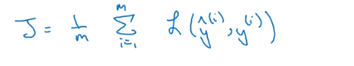
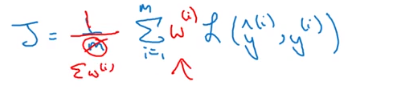
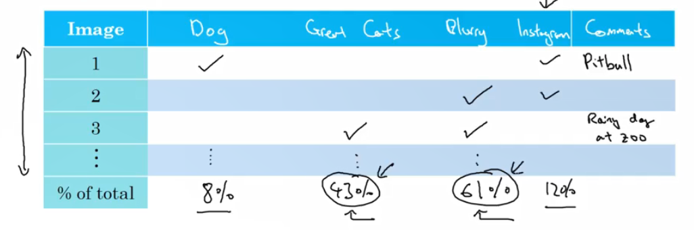

# 第9,10周学习报告  

`@Author 卢林军`  
`@Date 2020.04.30`  
[模型调整](#1) | [单一数值评估指标](#2) | [训练_开发_测试集划分](#3) | [进行错误分析](#4) | [迁移学习](#5) | [多任务学习](#6)


```
在这里简单的写一下一周总结
```

# <a id='1'>模型调整</a>

1. 保证至少模型在训练集上得到的结果不错，即在训练集上的表现必须通过某种测评达到可以接受的程度（更大的网络，更好的优化算法）
2. 在开发集上有好的表现
3. 在测试集上也有好的表现
4. 模型在测试集上系统的成本函数在实际使用中表现令人满意

# <a id='2'>单一数值评估指标</a>

1. 查准率：在你分类为正类的样本中，真正是正类的样本所占比例
2. 查全率：对所有是正类的样本，你的分类器正确识别出正类所占的比例
3. 存在问题：分类器A在查全率上表现更好，但分类器B在查准率上表现更好，你就无法判断哪个分类器更好。因此不推荐使用这两个指标去寻找优秀的分类器 
4. 结合查准率和查全率的标准的方法是使用F1分数：F1分数的细节并不重要，但非正式的可以认为是查准率P和查全率R的平均值。
    * $F_1 =\frac 2{\frac 1P + \frac 1R}$
5. 我们可以设置一个阈值，即门槛，如果没有达到这个门槛，我们就不在乎他的性能表现怎么样，比如说运行时间超过100ms我们就不使用这个模型，我们把这个阈值的名称，称为触发词。

# <a id='3'>训练_开发_测试集划分</a>

1. 步骤：
    1. 用训练集训练不同的模型
    2. 使用开发集来评估不同的思路，然后选择一个，然后不断迭代去改善开发集的性能，直到得到一个令人满意的成本
    3. 用测试集去评估模型
2. 将所有数据随机洗牌，让如开发集和测试集中，让测试集和开发集来自同一分布，只是不同的类型混杂在一起
3. 开发集合测试集的大小：训练集：开发集：测试集 = 98:1:1
4. 统计分类错误的例子
    * $error = \frac 1{M_{dev}} \sum_{i=1}^{M_{dev}}w^{(i)}l(y^{i}_{pred}\neq y^{(i)})$
    * l函数能统计这个式子为真的个数
    * $w^{(i)}$是权重
    * 当样本为正类时，W为1，否则W为100或者10
    * 这样使得，当分类错误的时候，错误率这个项快速变大
5. 如何精准命中目标
    * 定义指标
    * 假设我们定义一个成本函数为：
    * 
    * 我们可以通过加权实现正交化
    * 
6. 当我们的算法表现比人类的表现要好前，他的性能上升很快，当，性能超过人类表现时，那么他的进展就会减慢。我们都希望能打到理论最佳性能水平，随着时间的推移，当您继续训练算法时，但是性能无法超过某个理论上限，我们把这个称谓贝叶斯最优错误率
7. 当你的训练集错误率与你认为的贝叶斯错误率相差很大，那么你可以针对偏差进行调整（训练集的错误率），如培训更大的网络，用更好的优化算法，Momentun,RMSprop,Adam，反之，你应该针对方差进行调整（测试集的错误率），如正则化，获取更大的训练集
8. 假设人类水平的错误率为标准，计算他与训练集的错误率的差值，定义为A，训练集错误率与测试集错误率的差值定义为B，我们通过比较AB的大小，考虑从偏差调整还是从方差调整，我们称A为可避免误差
9. 如果你想让一个监督学习算法达到实用，基本上希望你可以完成两件事情
    * 首先你的算法对训练集的拟合很好
    * 其次，在训练集中做得很好后，然后推广到开发集和测试集也很好
10. 补充：
    * 准确度是优化指标; 运行时间和内存大小是满足指标。
    * 不同分布的数据集加入到原先的集合中会改变数据集原来的分布
    * 训练集的分布与验证集（或测试集）的分布不同不是问题，如果验证集与测试集的分布不同就会有很多的问题

# <a id='4'>进行错误分析</a>

1. 在模型设计过程中，我们可能将要区分的类别判断成别的类别（假阴性或假阳性），导致效果不是很好，如果我们针对这个其他类别进行改进的话，花费的时间可能很多，并且对这个改进的价值也不是很清楚，于是我们需要对这个进行错误分析
2. 我们可以绘制一张表格，包括，错误的样本集，错误的原因，以及评论。我们可以自己观察每一个样本，在对应的错误打钩，并进行评论，最后统计每一个错误在错误样本中的百分比，我们就能找到最有改进价值的方向。在这个过程中，你可能还会找到新的错误。
3. 拿猫分类器为例，他可能是和狗弄混了，或者和其他猫科动物弄混了，或者是照片模糊以及相机滤镜等等原因，我们可以按照上述的法法进行制表判断改进的方向。如下表：
4. 对于数据集本身标签错误时，这个因素也可以添加到表格中
5. 如果这些标记错误的样本，严重影响了你在开发集上评估算法的能力，那么就应该去花时间修正错误的标签，反之则不用
6. 观察指标：
    * 错误率~10%
    * 错误的数量或百分比~0.6%
    * 其他原因导致的错误率~9.4%
    * 此时应该针对其他原因，而不用针对标记错误
7. 额外的方针和原则：
    * 不论用什么修正手段，都要同时作用到开发集和测试集上
    * 检验算法判断正确和判断错误的例子
    * 通常指修改开发集和测试集的标签，因为他的数量比较小
8. 数据集处理：
    * 在数据集分布不单一，比如，有清晰的照片200K张和模糊的照片10K张做训练集时，我们想要让分类器在模糊的照片上处理得更好
    * 我们可以将清晰的照片200K张和模糊的照片5K张做训练集，然后2.5K张模糊的照片做开发集，2.5K张模糊的照片做测试集
9. 不匹配数据集划分的偏差和方差：
    * 指标：人类水平的错误率，训练集的错误率，训练-开发集的错误率，开发集的错误率
    * 人类水平的误差与训练集的误差——可避免误差
    * 训练集误差与训练集-开发集误差——方差
    * 训练集-开发集误差与开发集误差——数据不匹配
    * 开发集误差与测试集误差——过拟合程度
    * 算法擅长处理和你关心的数据不同的分布，称为数据不匹配
10. 定位数据不匹配：
    * 人工去观察开发集而不是测试集，要弄清楚开发集和训练集到底有什么不同
    * 人工合成数据，但可能对合成的这部分数据过拟合

# <a id='5'>迁移学习</a>

1. 假设你构建了一个能够很好处理图片的分类器，然后你想要把他迁移到放射图像上，你可以删除他的输出层以及输出层上的权重，然后重新初始化他们，将放射数据集带入到神经网络中进行训练，从而构建出应用于放射图像的神经网络。这个过程称为微调
2. 在删除输出层后，不一定只添加新的输出层，也可以自己拓展网络，多加几个隐藏层再加输出层
3. 什么时候迁移学习是有意义的？
    * 如果想从A迁移一些知识到B，那么当任务A和任务B都有同样的输入X时，迁移学习是有意义的（比如都是图像，或者都是音频）
    * 当任务A的数据比任务B多得多是迁移学习意义更大
    * 如果任务A的低层次特征可以帮助任务B学习，迁移学习更有意义

# <a id='6'>多任务学习</a>

1. 在多任务学习中，同时开始学习，试图让单个升级网络同时做几件事，希望这里每个任务都能帮助到其他所有任务
2. 比如我们的神经网络要判断一张图片中是否有车，人，标志，交通灯，我们的标签通常是(4,m)阶的，然后一列代表一个样本的标签，对存在的标签我们标记为1，不存在标记为0
3. 于是我们的损失函数可以定义为$y`^{[i]} = \frac 1m \sum_{i=1}^m \sum_{j=1}^4L(y`^{(i)}_j,y^{(i)}_j)$
    * 这里选择的L是logist回归的损失函数
    * $-(y^{(i)}_jlogy`^{(i)}_j+(1-y^{(i)}_j)log(1-y`^{(i)}_j))$
4. 多任务学习什么时候有意义：
    * 以下三个条件为真时有意义
    * 你训练的一组任务可以共用低层次特征
    * 在每一个任务中的数据量是相近的
    * 当你可以训练一个足够大的神经网络同时做好所有的工作
5. 端到端的深度学习
    * 舍弃从样本到结果的一些步骤，直接获得样本与结果对应的函数
    * 端到端的深度学习的好处
        * 首先端到端学习知识让数据说话，如果有足够多的样本，那么不管X到Y最适合的函数映射是什么，如果你训练一个足够大的神经网络，希望这个神经网络能自己搞清楚，而使用纯粹机器学习方法，直接从x到y输入去训练的圣经网络，可能更能捕获数据中的任何统计信息，而不是被迫引入人类的成见
        * 所需手工设计的组件更少
    * 缺点：
        * 可能需要庞大的数据取学习这个x到y的映射