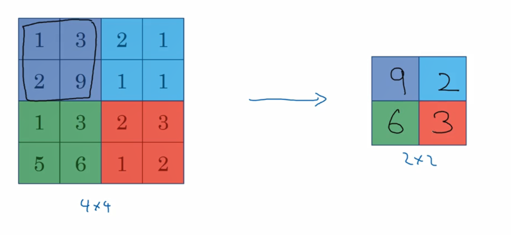
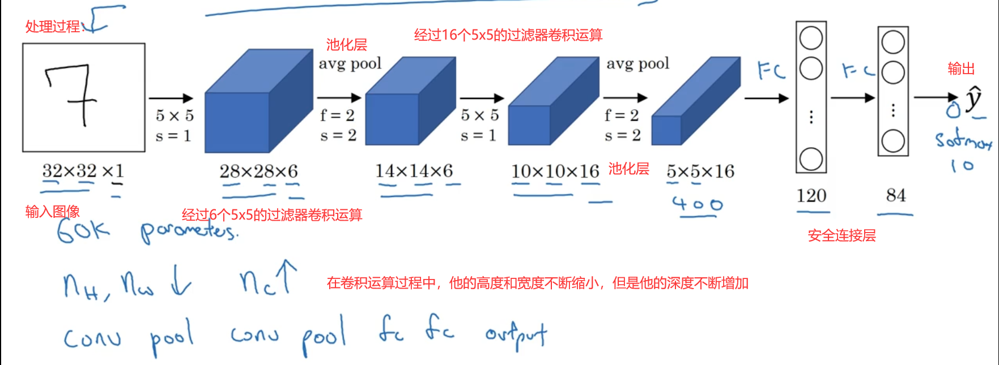
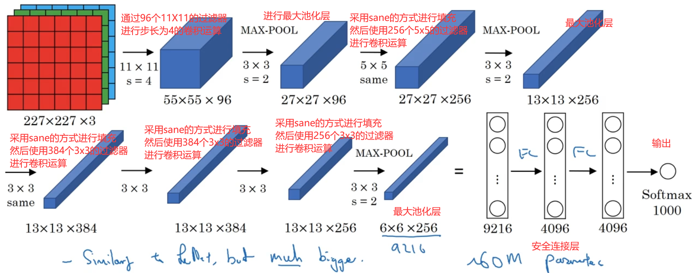
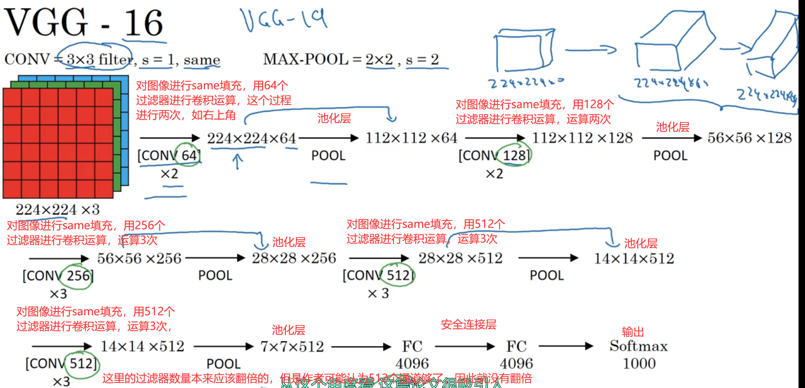
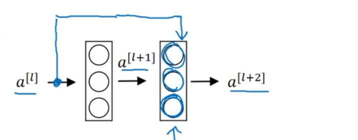
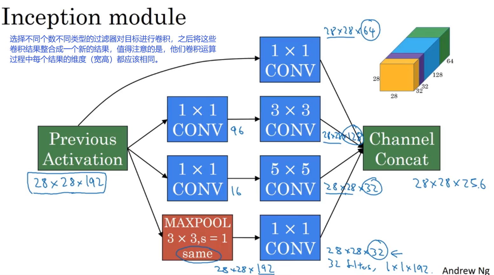
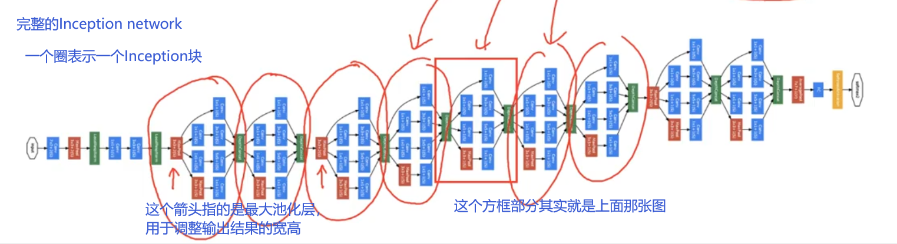
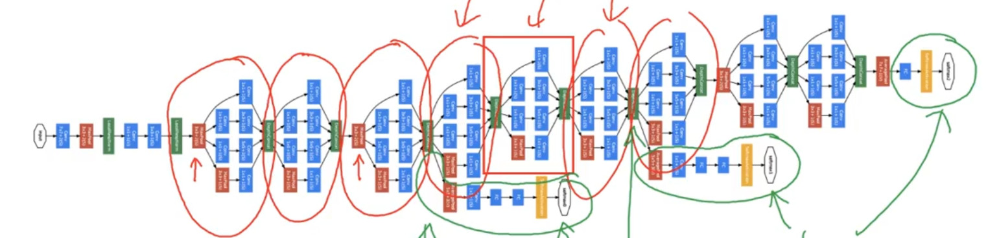

# 第11,12周学习报告  

`@Author 卢林军`  
`@Date 20200520`  
[边缘检测示例](#1) | [卷积神经网络](#2) | [卷积神经网络实例](#3) | [迁移学习](#4) | [数据扩充](#5)

```
在这里简单的写一下一周总结
```

# <a id='1'>边缘检测示例</a>

1. 对于任意一张图片来说，我们首先要做的就是对他进行边缘检测，检测图片中的垂直边缘
2. 面对一个6*6的灰度的图像，我们通常选择设置一个3x3的过滤器（filter），在中文里可以被称为核
    * 我们的卷积运算用*表示
    * 6x6的矩阵 * 3X3的矩阵，意思就是用后者（过滤器）对前者进行卷积运算
    * 其结果将为一个4x4的图像
    * 我们的过滤器(滤波器)矩阵为：

    ```html
    [1,0,-1]
    [1,0,-1]
    [1,0,-1]
    ```

3. 卷积运算
    * 第一步：将过滤器覆盖在图片矩阵的右上角，然后将其对应位置进行乘法运算，最后对这个矩阵中的每一个元素进行求和运算，得出的结果放入结果的第一行第一列
    * 第二步：将过滤器横向移动一格，做与上面相同的运算，结果存储在第一行第二列中。同上进行操作
    * 第三步：当遍历完图片矩阵的第一行，我们就将过滤器移动到最初开始的地方，然后向下平移一格，做与1,2步一样的操作
4. 在计算过程中，我们通常吧第一个乘数看做原始图片，第二个乘数(过滤器)也看成一个图片（相当于提取原始图片中的每一个小部分），在结果中，我们可以看成第三张图片，统计原始图片，在过滤器下的结果，这个过程就是垂直边缘检测器的原理。
5. 卷积运算：
    * python：conv-forward
    * tensorflow：tf.nn.conv2d
    * keras:Conv2D
6. 为什么这样做能做到垂直边缘检测？
    * 我们以一个6*6的一边黑一边白的图片作为例子，
    * 我们的数字表示亮度，如果数字是0，那么他是灰色的，如果比较大就是白色的
    * 所以我们的图片前三列是10，后三列是0，我们能够很清楚的明白分界边界在哪里
    * 于是我们使用过滤器（之前提到的矩阵），他的颜色是白灰黑，进行卷积运算
    * 我们的结果会得到，4*4的矩阵，第一列和最后一列是灰色的（都是0），中间两列都是白色的（都是30），你可以自己尝试去算一下
    * 然后我们能够很清楚地从4*4的矩阵中发现边界其实是在中间，你可能觉得误差很大，但是如果你使用的图片是1000X1000的图片，那结果误差应该很小了
    * 这就是为什么这种卷积运算能够实现垂直边缘检测
7. 更多边缘检测内容
    * 区分正边与负边，即从亮到暗和从暗到亮的过程
    * 按照之前所讲的例子，如果我们把原始图片白灰两边换成灰白两边进行卷积运算，结果就会是第一列和最后一列都是灰色，而中间两列都是黑色，这表示一个由暗到亮的过程
    * 水平边缘检测的过滤器：

        ```html
        [ 1, 1, 1]
        [ 0, 0, 0]
        [-1,-1,-1]
        ```

    * sobel滤波器：

        ```html
        [1,0,-1]
        [2,0,-2]
        [1,0,-1]
        ```

    * Schar滤波器：

        ```html
        [3,0,-3]
        [10,0,-10]
        [3,0,-3]
        ```

    * 上述两种东西也是一种垂直边沿检测的滤波器，如果把它旋转90°那么他们也可以转换成水平滤波器
    * 我们也不一定有使用这些别人给出的滤波器，我们可以设置滤波器为3x3的参数矩阵，然后通过反向传播的方法找到最合适的滤波器
    * 其性能甚至超过我们之前所写的任何滤波器
    * 相比于这里的水平和垂直边缘检测器，他可以检测45°，75°，甚至是任何角度的图像边缘

# <a id='2'>卷积神经网络</a>

1. 如果我们有一个nxn的图像，我们选择一个fxf的滤波器，对应的结果将会是(n-f+1)x(n-f+1)的图像
2. 这样会有两个缺点
    * 第一：每次做卷积操作，我们的图像都会缩小
    * 第二：边缘的像素点基本上如四个顶角基本上只会使用一次，而中间的像素点可能被多次使用，这就意味着我们丢失了原图像边缘部分的许多信息
3. 解决方案：
    * 在卷积操作之前，填充这幅图画，可以沿着图像的边缘，在填充一层像素，这样6x6的图像就会变成8x8的图像，输出的结果将会变成6x6的图像，这样就解决了图像缩小的问题
    * 通常我们使用0去填充这一层像素
    * 我们把p(padding)称为填充的数量，输出的结果将为(n+2p-f+1)x(n+2p-f+1)
    * 至于选择多少层p，通常有两个选择
        * Valid卷积神经网络：不填充（p = 0）即：nxn * fxf = (n-f+1)x(n-f+1)
        * Same卷积神经网络：填充之后输入和输出的大小是一样的：(n+2p)x(n+2p) * fxf = (n+2p-f+1)x(n+2p-f+1)
            * 因此，需要n+2p-f+1 = n即：p = (f-1)/2
    * 在习惯上滤波器的f通常是奇数的，我们很少看到偶数的滤波器
    * 如果f是奇数，那么会产生不对称填充
4. 卷积步长
    * 我们在移动滤波器的时候只移动一格，其实这个步长是可以调整的，我们称这个步长为卷积步长
    * 我么设步长为s，填充为p
    * 7x7 * 3x3 = 3x3(p=0,s=2)
    * nxn * fxf = [(n+2p-f)/s  +  1] x [(n+2p-f)/s  +  1]
    * 如果我们的商不是一个整数就向下取整
5. 滤波器的镜像翻转，滤波器的矩阵沿水平垂直翻转（第一行变成第三列并且顺序相反），然后将其带入图片原矩阵中进行卷积运算
    * 在深度学习构建卷积神经网络过程中，一般是不需要进行的，但是如果进行了这个操作效果可能会更好
6. 三维卷积
    * RGB：不在是灰度图像而是RGB构成的彩色图像，他的矩阵为6x6x3，图像有三层，他的三个维度分别表示，高，宽，通道
    * 他的滤波器为：3x3x3的矩阵，滤波器也有三层
    * 在卷积运算过程中，我们的原图片和滤波器的通道数量必须相等
    * 6x6x3的图片与3x3x3的滤波器进行卷积运算会获得一个4x4x1的矩阵
    * 将三维图片看成一个立方体，然后滤波器也看成一个立方体，我们会发现，我们在管道上的长度是一样的，因此我们只用在高宽方向上移动即可
    * 正如二维卷积计算一样，我们滤波器卷积计算出来的数值放在新矩阵的对应位置，由于3x3x3的空间最后只会变成一个数字，所以最终的结果就是二维的了
    * 如果想检测图像红色通道的边缘，那么我们可以在红色通道（第一层）设置一个二维滤波器，其他两个通道全部写成0
    * 如果你不关系是哪一个通道的垂直边缘，你就可以将滤波器的三层都设置为：

        ```html
        [1,0,-1]
        [1,0,-1]
        [1,0,-1]
        ```

    * 如果我们想同时使用水平过滤器和垂直过滤器，我们可以将两个计算结果叠加，就想RGB图像进行三层叠加一样叠加
    * 三维卷积的维度：nxnxc * fxfxc = (n-f+1)x(n-f+1)xc‘  这里的c'指的是使用的使用的过滤器数量

7. 单层卷积神经网络
    * 如第6点后面所讲的，如果我们使用两个过滤器就会得到两个4x4的矩阵，然后我们通过对这两个矩阵加一个偏差b1，b2,构成新的矩阵在丢入relu函数中实现激活，最后我们将两个矩阵叠加得到一个4x4x2的矩阵
    * 避免过拟合：用多个过滤器对原始图像进行处理，它可以使得参数固定不变，不管图片有多大
    * 符号介绍：
        * $f^{[l]}$ = filter size:过滤器大小，l来标记层数
        * $p^{[l]}$表示padding的数量，填充的数量
        * $s^{[l]}$记步幅
        * $n_C^{[l]}$过滤器的个数
        * 过滤器维度：$f^{[l]} * f^{[l]} * n_C^{[l-1]}$
        * 激活值：$a^{[l]}$维度为：$n_H^{[l]}$x$n_W^{[l]}$ x $n_C^{[l]}$
        * 向量化的激活值：$A^{[l]} = m * n_H^{[l]} * n_W^{[l]} * n_C^{[l]}$
        * 权重：$f^{[l]} * f^{[l]} * n_C^{[l-1]} * n_C^{[l]}$
        * 偏差b：$n_C^{[l]}$
        * 输入：上一层结果的维度$n_H^{[l-1]}$x$n_W^{[l-1]}$x$n_C^{[l-1]}$
        * 输出：这层的计算结果的维度$n_H^{[l]}$x$n_W^{[l]}$x$n_C^{[l]} $
        * 输出的高：$n^{[l]}_H = \frac {n^{[l-1]}_H+2p^{[l]}-f^{[l]}}{s^{[l]}}+ 1$
        * 输出的宽：$n^{[l]}_H = \frac {n^{[l-1]}_H+2p^{[l]}-f^{[l]}}{s^{[l]}}+ 1$
8. 池化层（pool）
    * max pool：
    * 如上图的4x4矩阵，讲其分成每一个区域，然后选出每一个区域中的最大值，放入新的矩阵中
    * 最大池化层的超参数：f=2,s=2（常见超参数）
    * 对每一层都会进行池化层计算
    * 也可以使用平均池化层，就是对每一个区域取均值
9. 在卷积神经网络的最后一层得出结果后，需要把这个三维矩阵转化成一个列向量，然后放入激活函数中
10. 安全连结层，在转化成列向量（400）后通过一个（120,400）的权重w构造出安全连结层（120），然后就可以带入激活函数中了
11. 为什么要用卷积神经网络？
    * 和只用安全连接层相比，卷积层的两个主要优势是：参数共享和稀疏链接
    * 参数共享：特征检测如垂直边缘检测如果适用于图片的某个区域，那么他也可能适用于图片的其他区域

# <a id='3'>卷积神经网络实例</a>

## LeNet—5

1. 这个网络只针对灰度图像（只有一个通道）
2. 流程：

## AlexNet

1. 与LeNet-5相似，但是他可以处理RGB图像，内容比LeNet-5大得多
2. 使用了relu函数作为激活函数
3. 流程：
4. 经典的AlexNet还有一种类型的层：叫做“局部响应归一化层”即LRN层，但是运用得不多
    * 基本思路：在图形上取一个点，然后取出这个点在每一个通道对应的数据，对其进行归一化
    * 目的是消除图像过多的高激活神经元，但是后面的研究证明似乎用处不大

## VGG-16

1. 他没有那么多的超参数，这是一种只需要专注于构建卷积层的简单网络
2. 他简化了神经网络的结构
3. 名称中的16指的是卷积层和安全连接层一共有16个，他的参数非常庞大，但是他的结构并不复杂
4. 在网络运行过程中，每经过一个卷积层图像就会缩小一倍，然后通道增加一倍，使得图形的变换变得很有规律
5. 流程：

## ResNets(残差网络)

1. 残差块(Residual block)：
    * 远跳链接，他可以跨过好几个层，然后到达深层网络，在线性激活之后，在relu激活之前，与$Z^{[l]}$相加，作为待激活值，带入relu函数中
    * 如图：
    * 然后我们在第L+2层的激活着就为：$a^{[l+2]} = g(z^{[l+2]} + a^{[l]})$
2. 残差神经网络
    * 构建一个ResNet网络就是通过将很多这样的残差块堆积在一起形成的一个深度神经网络
    * 残差神经网络
3. 为什么RestNets会有如此好的表现？
    * 在卷积过程中，如果使用L2正则化，我们的W就会被压缩，最后趋近与0，对于远跳链接的结果，我们的$a^[l+2]$就会趋近于0，只剩下$a^{[l]}$，在次学习这个，会学到新东西，至少不会降低效率
    * 之所以$a^[l+2]$与$a^{[l]}$能相加说明其维度相同，因此这里使用了大量的SAME的填充。
    * 但如果$a^[l+2]$与$a^{[l]}$的维度确实不相同，也可以给$a^{[l]}$增加一个参数$W_s$让其与$a^{[l]}$相乘使得$a^[l+2]$与$a^{[l]}$的维度相同或者使用padding的方法，用填充到相同维度

## 网络中的网络以及1x1卷积

1. 在一个通道的图像中，如果使用1x1的卷积就类似于每一个数乘一个常数，效果不佳
2. 但是在多通道中，对多个通道来说，每一层上的每一格相当于普通神经网络的输入，然后我们的1x1过滤器，会拓展到与目标相同的通道，这就相当于普通神经网络的线性激活，在经过relu激活，就可以向神经网络一样学习到东西
3. 我们把这种过程称为网络中的网络(Network in Network)
4. 压缩通道(n_c)的方法：使用N个与前一层同通道数的过滤器，我们就能将通道压缩至N层

## inception网络

1. 帮你选择过滤器的大小
2. 基本思想：
    * inception网络不需要人为决定使用哪个过滤器，或是否需要池化，而是由网络自行确定这些参数，可以给网络添加这些参数的所有可能的值，然后把这些输出连接起来，让网络自己学习他需要什么样的参数
3. 基本模型块：
4. 完整的inception网络：
5. 在inception网络中的隐藏层处还有分支，即除了在输出层预测结果外，对隐藏层内部也会产生分支进行隐藏层预测结果,图中采用的是softmax
6. 他确保了即便是在隐藏单元和中间层也参与了特征计算


# <a id='4'>迁移学习</a>

1. 用别人已经训练好的权重参数套入到我们的模型中，从而减少我们所需的训练时间
2. ImageNet数据集，在寻找开源的图像识别代码时，可以吧人家的权重下载下来，然后直接运用到我们的训练集上
3. trainableParameter=0参数：大多数框架都有这个参数，确保不训练被这个参数标记的权重
4. 对于冻结权重，可以根据你的需求选择要冻结的部分，留剩下一部分训练或删除，或构建新的权重

# <a id='5'>数据扩充</a>

1. 垂直镜像对称：镜像对称图片从而获得新的样本
2. 随机修剪：对图片主题部分进行随机裁剪，保留其主要特征，从而扩大样本
3. 色彩转换：对R,G,B三通道加上不同的失真值，从而修改图片的色值，从而扩大样本